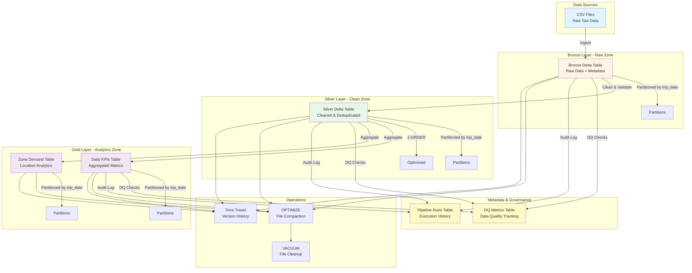

# NYC Taxi Data Lakehouse Architecture

## Overview

This document describes the architecture of the NYC Taxi Data Lakehouse ETL pipeline, implementing a Bronze-Silver-Gold (Medallion) architecture using Apache Spark and Delta Lake.

## Architecture Diagram

## Data Flow

### 1. Bronze Layer (Raw Zone)
- **Purpose**: Ingest raw data with minimal transformation
- **Operations**:
  - Read CSV files
  - Add metadata columns (`ingestion_ts`, `source_file`)
  - Partition by `trip_date` (derived from pickup datetime)
  - Write to Delta table
- **Schema**: Flexible schema allowing all source columns
- **Write Mode**: Overwrite (or Append for incremental)

### 2. Silver Layer (Clean Zone)
- **Purpose**: Clean, validate, and conform data
- **Operations**:
  - Read from Bronze
  - Cast columns to proper types
  - Apply data quality filters
  - Deduplicate records
  - Partition by `trip_date`
  - Z-ORDER optimization
  - Write to Delta table
- **Schema**: Strict schema validation
- **Write Mode**: Overwrite (or Merge for incremental)

### 3. Gold Layer (Analytics Zone)
- **Purpose**: Aggregated analytics-ready tables
- **Tables**:
  - **Daily KPIs**: Daily trip counts, revenue, averages
  - **Zone Demand**: Location-based trip and revenue metrics
- **Operations**:
  - Read from Silver
  - Aggregate by date/location
  - Partition by `trip_date`
  - Write to Delta tables

## Key Features

### Data Quality Framework
- Schema validation at each layer
- Configurable DQ checks (nulls, ranges, row counts)
- DQ metrics stored in Delta table
- Historical tracking of data quality

### Performance Optimizations
- **Partitioning**: Date-based partitioning for efficient queries
- **Z-ORDER**: Column-based optimization for common filters
- **OPTIMIZE**: File compaction to reduce small files
- **VACUUM**: Cleanup of old files

### Incremental Processing
- Watermark-based incremental loads
- MERGE operations for updates
- Configurable initial load dates

### Delta Lake Features
- **Time Travel**: Query historical versions
- **Version History**: Track all changes
- **ACID Transactions**: Guaranteed consistency
- **Schema Evolution**: Handle schema changes gracefully

### Orchestration
- DAG-based task execution
- Dependency management
- Retry logic
- Task status tracking

## Technology Stack

- **Apache Spark**: Distributed data processing
- **Delta Lake**: ACID transactions and time travel
- **PySpark**: Python API for Spark
- **PyYAML**: Configuration management
- **PyTest**: Testing framework

## Environment Support

- **Development**: Lenient DQ checks, no optimization
- **Production**: Strict DQ checks, full optimization, incremental processing

## Monitoring & Observability

- **Pipeline Runs Table**: Execution history and metrics
- **DQ Metrics Table**: Data quality tracking over time
- **Structured Logging**: JSON-formatted logs with timestamps
- **Job Metadata**: Row counts, durations, errors

## Scalability Considerations

- Partitioning enables parallel processing
- Z-ORDER improves query performance
- Incremental processing reduces reprocessing overhead
- Delta Lake handles large-scale data efficiently

